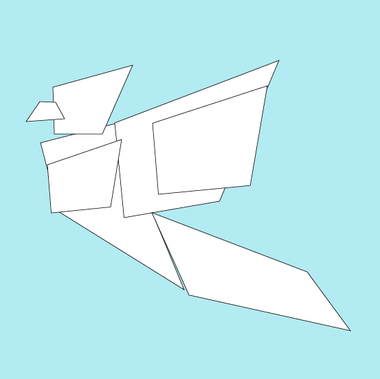

<!DOCTYPE html>
<html lang="en">
  <head>
    <meta charset="UTF-8">
    <title>Web Development</title>
    <link rel="stylesheet" href="Styles.css">
    <link rel="icon" href="favicon (1).ico">
    <link href="https://fonts.googleapis.com/css2?family=Dancing+Script:wght@600&display=swap" rel="stylesheet">
    <link href="https://fonts.googleapis.com/css2?family=Recursive:wght@700&display=swap" rel="stylesheet">
  </head>
  <body>
    <!---
      

        My site
      

    --->
    <h1 class="heading"></h1>

    

      
      
      
      <h1>I'm Mahir</h1>
      <h2 class="subtitle">A Student</h2>
      

       
       
    

  <!---Box-2--->
    

          

              
            

              
              

                <h2>Hello.</h2>
                
You can always feel free to share your problems with me and let me know how I can help you.

              

            

            

      <!---skills--->

            

              <h2>My Skills.</h2>
              

                
                <h3>Coding</h3>
                
I have a great interest in computer programming and website building. If we make our relation beautiful then we can help each other.

              

               
              

               
              

                
                <h3 class="skill-row-2-para">Origami</h3>
                
I have many hobbies. Reading, playing, studying, problem solving etc but I love origami the most .

              

               
              

               
              

                
                <h3 class="skill-row-3-para">Logic</h3>
                
I also love mathematical and logical problem solving. It makes one able to think independently and science and logic can explain this mysterious nature.

              

            

             

      <!---skills--->

      <!---contacts--->

            

             
            

              <h2>Get In Touch</h2>
              <h3>If there is a scope that we can help each other or we are good friends then we should get in touch</h3>
              
You can also press the button below to contact me by email. My Facebook profile link is also given below

              <a class="btn" href="mailto:mahirfaisal854@email.com">CONTACT ME</a>
            

      <!---contacts--->

          

        

      <!---Box-2--->

      <!---Box-3--->

        

          <a class="footer-link" href="https://www.facebook.com/me/">Facebook</a>
          
© 2020 Mahir Faisal.

        

          <!---Box-3--->

  </body>

</html>
